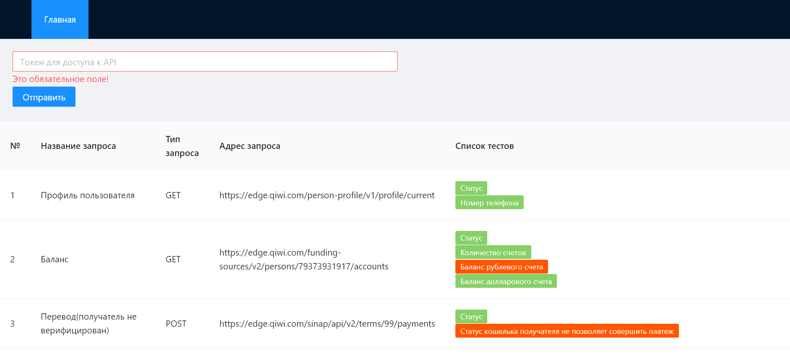
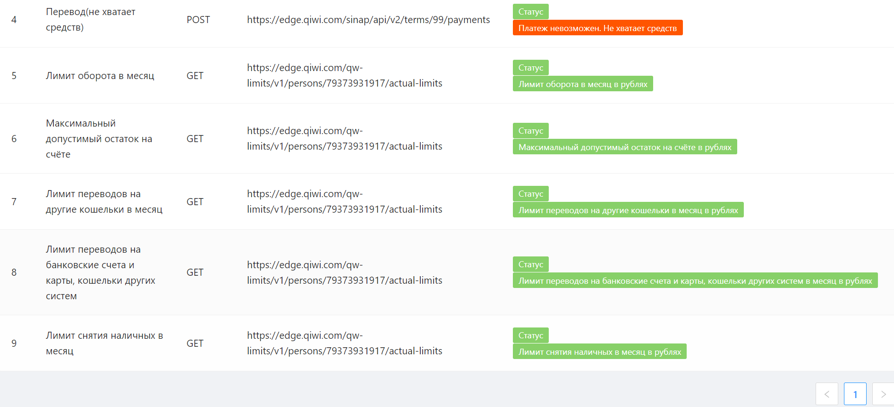
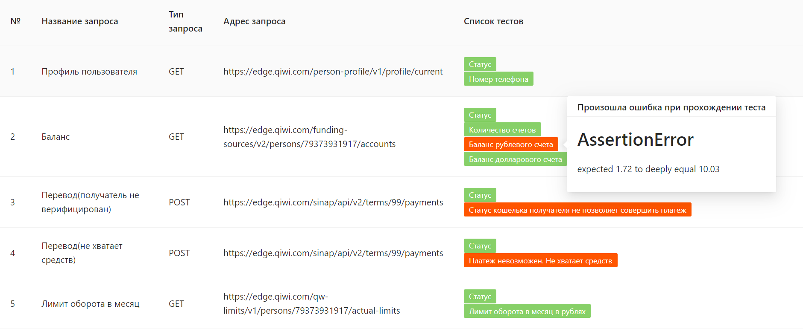

## QIWI API tests

This is a simple user interface for testing some requests to qiwi api.

# Technology stack

Server
+ Express
+ Newman

Client

+ React
+ Ant-design
# Installation

Install all requirements for server and client.
```
npm run init
```

# Run
Run server.
```
npm run server
```
Run client.
```
npm run client
```

# Using

Generate token on link https://qiwi.com/api and input it in the form.



